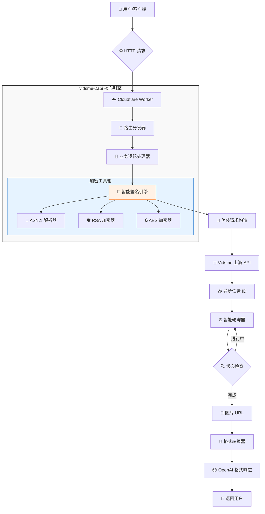
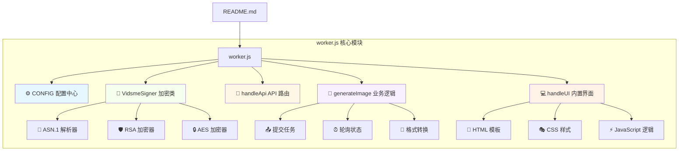

# 原网站：https://www.gentube.app/
> （2025年11月21日 22:59:41完成逆向中转API）


# 具体效果：


# 🌌 vidsme-2api (Cloudflare Worker 版本)

> **Project Chimera: Synthesis Edition (v2.0.3)**
> *"将复杂的混沌，编织成优雅的接口。"*

[](https://deploy.workers.cloudflare.com/?url=https://github.com/lza6/vidsme-2api-cfwork)
[](https://opensource.org/licenses/Apache-2.0)
[](https://github.com/lza6/vidsme-2api-cfwork)
[](https://workers.cloudflare.com/)

---

## 📖 目录

1. [项目哲学与愿景](#-项目哲学与愿景)
2. [这是什么？](#-这是什么)
3. [核心架构与原理](#-核心架构与原理)
4. [小白懒人教程：一键部署](#-小白懒人教程一键部署)
5. [开发者指南：技术深度解析](#-开发者指南技术深度解析)
6. [API 使用文档](#-api-使用文档)
7. [项目结构与 AI 蓝图](#-项目结构与-ai-蓝图)
8. [优缺点与局限性](#-优缺点与局限性)
9. [未来路线图](#-未来路线图)
10. [开源协议](#-开源协议)

---

## 🧘 项目哲学与愿景

在这个 AI 爆发的时代，技术的壁垒看似在降低，实则在以另一种形式重组。**vidsme-2api** 不仅仅是一个代码仓库，它是一种**"技术平权"**的实践。

我们相信：
*   **极简主义：** 真正的强大不需要庞大的依赖库。单文件即是宇宙。
*   **鲁棒性：** 代码应像水一样，既能适应容器（环境），又能滴水穿石（攻克加密）。
*   **开源精神：** "他来他也行"。我们希望通过详尽的代码注释和文档，让每一位阅读者都能感受到编程的乐趣，理解加密学的奥秘，并激发动手的勇气。

---

## 🧩 这是什么？

**vidsme-2api** 是一个运行在 Cloudflare Worker 上的**无服务器中继程序**。

它将 `chatsweetie.ai` (vidsme) 的图像生成服务，无损、高效地转换为标准的 **OpenAI 格式 API** (`/v1/chat/completions` 和 `/v1/images/generations`)。

### ✨ 核心价值

1.  **标准化：** 让不支持特定绘图 API 的客户端（如 NextChat, LobeChat, BotGem 等）能直接调用绘图能力。
2.  **隐匿性：** 所有的加密签名、请求头伪装都在云端完成，客户端无需关心复杂的鉴权逻辑。
3.  **零成本：** 依托 Cloudflare Worker 的免费额度，无需购买服务器，无需维护 Docker。
4.  **可视化：** 内置了一个精美的"开发者驾驶舱" UI，可以在浏览器直接测试生成效果。

---

## 🏗️ 核心架构与原理

我们采用了一种"**中间人代理 + 协议转换**"的智能架构。



### 🧠 技术栈详解

*   **运行环境：** Cloudflare Workers (V8 Isolate)
*   **加密学核心：**
    *   **ASN.1 解析器：** 手写解析器，用于动态读取 PEM 格式公钥的模数和指数
    *   **RSA-PKCS1-v1.5：** 使用 JS `BigInt` 实现的大数模幂运算，不依赖外部加密库
    *   **AES-CBC：** 使用原生 `crypto.subtle` Web Crypto API 进行对称加密
*   **用户界面：** Web Components (Shadow DOM) 实现的独立前端，无框架依赖

---

## 🚀 小白懒人教程：一键部署

即使你完全不懂代码，只需 3 步，你也能拥有自己的绘图 API。

### 第一步：准备工作
1.  🆓 注册一个 [Cloudflare](https://dash.cloudflare.com/) 账号
2.  📝 拥有一个 GitHub 账号

### 第二步：一键部署
点击下方的按钮，Cloudflare 会自动拉取本仓库代码并部署。

[](https://deploy.workers.cloudflare.com/?url=https://github.com/lza6/vidsme-2api-cfwork)

### 第三步：配置与使用
1.  ⚙️ 部署完成后，在 Cloudflare 后台找到你的 Worker
2.  ✏️ 点击 **"编辑代码"**
3.  🔑 在代码顶部的 `CONFIG` 区域，修改 `API_MASTER_KEY` 为你自己设置的密码（例如 `"sk-mysecret123"`）
4.  🚀 点击 **"部署"** 保存更改
5.  🌐 访问你的 Worker 域名（例如 `https://vidsme-2api.xxx.workers.dev`），你将看到**开发者驾驶舱**，代表部署成功！🎉

---

## 🔬 开发者指南：技术深度解析

对于渴望知识的开发者，这里是核心技术的详细拆解。

### 1. 手写 ASN.1 解析器 (`parsePem`)
*   **技术背景：** 上游公钥是 PEM 格式，Web Crypto API 导入 PEM 往往需要特定格式转换
*   **创新实现：** 我们直接解析 ASN.1 二进制结构，跳过 `SEQUENCE` 和 `BIT STRING` 标签，精确定位到 RSA 的 `模数 (n)` 和 `指数 (e)`
*   **技术难度：** ⭐⭐⭐⭐⭐ (通常需要引入 50KB+ 的库，我们用 30 行代码解决了)

### 2. BigInt RSA 加密 (`rsaEncrypt`)
*   **数学原理：** RSA 加密核心是 $C = M^e \mod n$
*   **工程实现：** JS 的 `number` 类型精度不够，我们利用 ES2020 的 `BigInt` 进行大数运算，同时实现了 PKCS#1 v1.5 的填充标准
*   **标准遵循：** 基于 RFC 2313 标准规范实现

### 3. 防御性编程实践
*   **HTML 错误处理：** 上游服务有时会返回 Nginx 的 502 HTML 页面而非 JSON。代码中的 `safeFetch` 函数会捕获 `JSON.parse` 错误，防止 Worker 崩溃，并返回可读的错误信息
*   **异常恢复：** 所有关键操作都有 try-catch 保护，确保服务稳定性

---

## 🔌 API 使用文档

### 基础信息
*   **基础 URL：** `https://你的域名.workers.dev/v1`
*   **认证方式：** `Bearer 你的API_MASTER_KEY`

### 1. 聊天接口 (推荐使用)
兼容 GPT-4 Vision 格式，直接返回 Markdown 图片链接。

*   **端点：** `POST /chat/completions`
*   **请求体：**
    ```json
    {
      "model": "anime",
      "messages": [{"role": "user", "content": "一个赛博朋克女孩，霓虹灯光"}]
    }
    ```

### 2. 绘图接口
标准的 OpenAI DALL-E 格式。

*   **端点：** `POST /images/generations`
*   **请求体：**
    ```json
    {
      "prompt": "宁静的风景，水彩风格",
      "model": "realistic",
      "size": "2:3"
    }
    ```

### 🎨 支持的模型类型
*   `anime` (动漫风格 - 默认)
*   `realistic` (写实风格)
*   `hentai` (二次元特定风格)
*   `hassaku` (Hassaku 模型)

### 📐 支持的图片比例
*   `1:1` (正方形)
*   `2:3` (竖版)
*   `3:2` (横版)
*   `16:9` (宽屏)

---

## 📂 项目结构与 AI 蓝图

为了方便 AI Agent 爬取和理解本仓库，以下是完整的文件结构与逻辑映射。



### 🤖 面向 AI Agent 的技术说明
*   **技术栈：** JavaScript (ES Modules), Cloudflare Workers API
*   **核心逻辑：**
    1.  **签名机制：** `AES(AppID + Salt + Time + Nonce, RandomKey)` + `RSA(RandomKey, PublicKey)`
    2.  **轮询策略：** 指数退避或固定间隔轮询 `job_id` 状态
    3.  **格式转换：** 将专有 JSON 响应转换为 OpenAI 标准格式

---

## ⚖️ 优缺点与局限性

### ✅ 优势亮点
1.  **🎯 极致轻量：** 单文件部署，无 `node_modules` 依赖黑洞
2.  **🔗 高兼容性：** 只要支持 OpenAI 接口的软件都能无缝使用
3.  **🛡️ 抗封锁：** 动态生成签名和指纹，模拟真实浏览器行为
4.  **📚 教育意义：** 源码是学习 JS 加密和 Worker 编程的绝佳教材

### ⚠️ 限制与待完善
1.  **🚦 并发限制：** Cloudflare 免费版有 CPU 时间限制，高并发下 RSA 运算可能导致超时
2.  **🔗 上游依赖：** 如果 `vidsme` 更改了公钥或签名算法，需要及时更新代码
3.  **🌊 无流式传输：** 图片生成本质是异步的，无法像文本那样流式输出

---

## 🗺️ 未来路线图

我们计划在未来的版本中实现以下功能：

*   [ ] **v2.1.0：** 引入 KV 存储，支持多账号轮询，突破单 IP 限制
*   [ ] **v2.2.0：** 增加图生图的 API 适配功能
*   [ ] **v2.3.0：** 优化 ASN.1 解析器，支持更多种类的 PEM 格式（如 PKCS#8）
*   [ ] **v3.0.0：** **Project Hydra：** 将核心加密逻辑抽离为 WASM 模块，大幅提升性能

---

## 📜 开源协议

本项目采用 **Apache License 2.0** 协议开源。

### ✅ 你可以：
*   商业使用
*   修改代码
*   分发副本
*   私有使用

### ℹ️ 你必须：
*   保留版权声明和许可证副本
*   说明代码变更

---

> **致开发者：**
>
> 代码是冰冷的逻辑，但开源赋予了它温度。希望 `vidsme-2api` 能成为你工具箱里一把趁手的兵器。
>
> *用心创造 ❤️ 由首席 AI 执行官与你共同打造。*

---

### 🎯 快速开始 Checklist

- [ ] 注册 Cloudflare 账号
- [ ] 点击一键部署按钮
- [ ] 设置 API 主密钥
- [ ] 访问开发者驾驶舱测试
- [ ] 集成到你的应用中

**遇到问题？** 欢迎在 GitHub 仓库中提交 Issue，我们会尽快回复！
